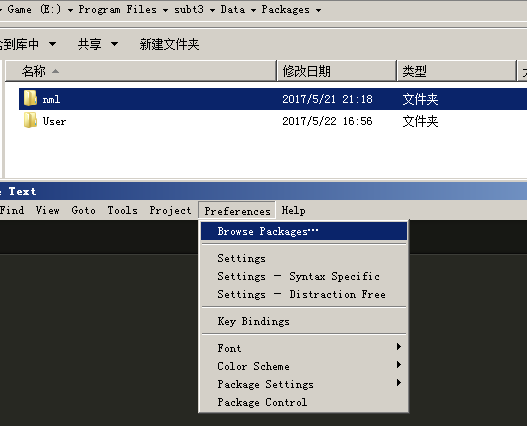

sublime-nekoml
------

Note: This is the first time I tried to write syntax definition, so it probably has some Bug

### Install

1. installation requirements: Sublime text 3 build 3103 + Package Control
2. `Menu -> Preferences -> Browse Packages...`
3. 'git clone https://github.com/R32/sublime-nekoml.git nml --depth=1'

  

### features

* Syntax highlighting for `*.nml` file

* Auto Completion(only core lib)

  - setting: `"auto_complete_triggers": [ {"characters": ".", "selector": "source.nml"} ]`

* Goto Definition: `F12`,Jump Back: `Alt + -`

  - Need add `/neko-master/src/core` Folder to current project. 

     > `Menu -> Project -> Add Folder to Project...`

* **NEW** `.neko` syntax hightlighting(Partial) and auto Completion(only for builtins)

  - setting: `"auto_complete_triggers": [ ...,{"characters": "$", "selector": "source.neko"} ]`

